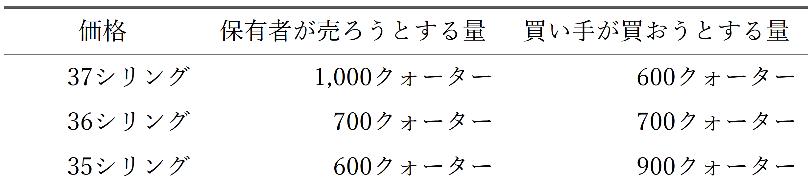

# 第二章　需要と供給の一時的均衡

## 一

欲望と努力がつり合う、つまり均衡するとはどういうことか。その最も単純な例は、人が自分の欲求を、自分の直接の働きで満たす場合に見られる。少年が自分で食べるためにブラックベリーを摘むとき、初めのうちは、摘むこと自体にも楽しみがある。しばらくは、食べる楽しみが摘む手間を十分に償ってくれる。しかしかなり食べると、もっと食べたいという気持ちは弱まり、摘む仕事には疲れが出てくる。その疲れは、肉体の疲労というより、同じことを続ける退屈さかもしれない。やがて、遊びたい気持ちや摘む仕事を嫌がる気持ちが、なお食べたいという欲望とつり合う。そこが均衡である。果実を摘むことから得られる満足は、そこで最大に達する。それまでは、一つ摘むごとに、失われる楽しみより大きな楽しみが加わっていた。ところがその後は、さらに摘むことによって加わる楽しみよりも、失われる楽しみのほうが大きくなる。

一人の人が、別の一人の人とたまたま取引をする場合には、需要と供給の均衡と厳密に呼べる状態は、めったに生じない。たとえば奥地に住む二人が、銃とカヌーを交換するような場合である。このような取引では、おそらく双方に、なお満足を増やす余地が残る。一方の人は、ほかにカヌーを手に入れる方法がなければ、銃に何かを添えてもよいと思うだろう。もう一方の人も、必要に迫られれば、カヌーに何かを添えて銃を得てもよいと思うだろう。

物々交換の場合でも、真の均衡に到達することはありうる。しかし物々交換は、歴史の上では売買より古いとはいえ、いくつかの点ではむしろ複雑である。真の均衡価値を考えるうえで最も単純な例は、より進んだ文明段階にある市場の中に見いだされる。

実際の重要性が小さい取引については、ここでは脇に置いてよい。たとえば巨匠の絵画や希少な硬貨のように、等級をつけて扱えない物の取引である。こうした物の価格は、売り場にそれを強く欲しがる富裕な人物がいるかどうかに大きく左右される。そうした人物がいなければ、あとで利益を得て転売できると見込む業者が買い手になる。同じ絵でも競売のたびに価格は大きく変わるが、専門の買い手が市場に一定の安定を与えていなければ、その変動はいっそう大きかったはずである。

## 二

そこで、近代生活でふつうに見られる取引に目を向け、地方都市の穀物市場を例に取ろう。話を単純にするため、市場に出ている穀物はすべて同じ品質だとする。農民その他の売り手が、ある価格でどれだけ売るかは、手元の現金をどれほど必要としているか、またその市場の現在と将来をどう見ているかによって決まる。どの売り手も受け入れないほど低い価格があり、反対に誰も拒まないほど高い価格がある。その中間には、多くの売り手、あるいはすべての売り手が、量に差はあっても応じる価格がある。誰もが市場の状態を読み、それに合わせて動くのである。たとえば実際には、三十五シリングなら売ってもよいと考える保有者の穀物は六百クォーター以下だとしよう。三十六シリングなら、さらに百クォーター分の保有者が売る気になり、三十七シリングなら、さらに三百クォーター分の保有者が売る気になるとする。一方、三十七シリングでは買い手は六百クォーター分しか現れず、三十六シリングならさらに百クォーター、三十五シリングならさらに二百クォーター売れるとする。これを表にすると次のようになる。

<figure class="table-image">
  
</figure>

もちろん実際には、売れずに帰るより三十六シリングで売るほうがよいと思っている者でも、その用意をすぐには見せないことがある。買い手も同じように駆け引きをし、本当ほど熱心ではないふりをする。こうして価格は、市場での値踏みと交渉のなかで、どちらの側が優勢になるかに応じて揺れ動くかもしれない。しかし双方の力が大きく不均衡でない限り、たとえば一方が相手の強さを見誤るほど単純であったり、不運であったりしない限り、価格は三十六シリングから大きく離れにくい。そして市場の終わりには、ほぼ三十六シリングに近づく可能性が高い。保有者としては、買い手が三十六シリングで欲しいだけ手に入れられると考えるなら、それをかなり上回る申し出を逃したくないからである。

買い手も、売り手と同じように先を読んで行動する。価格が三十六シリングをかなり上回れば、その価格では供給が需要を大きく上回ると見る。すると、その値段を払ってでも品物を手に入れたい買い手でさえ、しばらく待てば価格は下がると考えて買い控える。反対に、価格が三十六シリングをかなり下回れば、売れ残りを持ち帰るくらいならその値で売ってもよいと思う売り手でさえ、その価格では需要が供給を上回ると見る。そこで売り手は待つことを選び、その待つ行動が価格を押し上げる。

こう考えると、三十六シリングを真の均衡価格と呼ぶ理由がある。この価格が最初に決まり、そのまま最後まで保たれるなら、需要と供給は正確に一致するからである。すなわち、その価格で買い手が買おうとする量は、売り手が売ってもよいと考える量とちょうど等しい。また、市場の事情を十分に知っている取引者なら、皆この価格が成立すると予想する。価格が三十六シリングから大きく離れていれば、いずれ修正されると見込み、その変化を先取りして行動する。そのため、価格の変化はいっそう早まる。

ただし、この議論は、取引者の誰かが市場の事情を完全に知っていることを前提にしているわけではない。買い手の多くが、売り手がどれだけ売る用意をしているかを小さく見積もれば、しばらくは買い手が見つかる最高に近い価格が支配し、価格が三十七シリングを下回る前に五百クォーターが売れることもありうる。しかしその後は価格が下がり始め、結局さらに二百クォーターが売れて、市場はおよそ三十六シリングで終わる可能性が高い。七百クォーターが売れた時点では、三十六シリングを超えなければさらに売りたい売り手はおらず、三十六シリングを下回らなければさらに買いたい買い手もいないからである。同じように、売り手が、買い手が高値を払う用意をしていることを小さく見積もれば、穀物を残すよりはましだとして、低い価格で売り始める者が出るかもしれない。その場合、多くが三十五シリングで売れることもある。それでも市場はおそらく三十六シリングで終わり、総販売量は七百クォーターとなる。

## 三

この例には、多くの市場にはよく当てはまるが、ほかの場合にそのまま広げてはならない仮定が含まれている。つまり、七百番目のクォーターについて、買い手が払ってもよいと思う金額と、売り手が受け取ってもよいと思う金額は、それ以前の取引が高値で行われたか安値で行われたかに左右されない、と見ていたのである。買われる量が増えれば、買い手にとって穀物の必要度、すなわち限界効用は下がる。この点は考慮した。しかし、貨幣を手放したくない気持ち、すなわち貨幣の限界効用が目に見えて変わるとは考えなかった。初めに多く払っても少なく払っても、その差は実際上無視できると仮定したのである。

この仮定は、現実の市場取引の大部分では正当である。人が自分で消費するために買う場合、ふつう支出するのは総資力のごく一部にすぎない。商売のために買う場合も、再販売を見込んでいるので、潜在的な資力が減るわけではない。どちらの場合にも、貨幣を手放したくない気持ちに目立った変化は起こらない。そうでない個人がいるとしても、市場にはたいてい、自由に使える多額の貨幣を持つ取引者がいる。その存在が市場に安定した力を及ぼす。

この仮定から外れる場合は、商品市場ではまれであり、重要性も小さい。しかし労働市場では、それがしばしば起こり、しかも重要である。労働者が飢えを恐れているとき、彼にとって貨幣の必要度、すなわち限界効用は非常に大きい。最初の交渉で不利な立場に置かれ、低い賃金で雇われると、その必要度は大きいまま残り、低い賃金で労働を売り続けることになりやすい。実際、その可能性は高い。商品市場では交渉上の優位が売り手と買い手の双方にかなり分かれるのに対し、労働市場では買い手の側にあることが多いからである。さらに、労働の売り手は、一人ひとりが売ることのできる労働を一単位しか持っていない。これらは多くの事実のうちの二つにすぎないが、のちに見るように、労働階級が一部の経済学者、とくに雇用主階級の経済学者に対して抱いてきた本能的な反感を説明するものとなる。彼らは労働を単なる商品として扱い、労働市場をほかの市場と同じように見がちだった。しかし実際には、二つの場合の違いは、理論上は根本的でないとしても明確であり、実際上はしばしば非常に重要である。

商品だけでなく貨幣についても、限界効用は手元にある数量によって変わる。そう考えると、売買の理論はずっと複雑になる。ただし、この点が実際に大きな意味をもつわけではない。付録Ｆでは、物々交換と、交換の一方が一般的購買力、つまり貨幣の形をとる取引との違いが示されている。物々交換では、交換される二つの商品について、それぞれの保有量が各人の欲求にかなり合っていなければならない。多すぎれば十分に使いきれず、少なすぎれば、自分の欲しい物を持っていて、しかも自分の余り物を欲しがる相手を見つけるのが難しくなる。これに対して、一般的購買力を持っていれば、欲しい物を余らせている相手に出会ったとき、すぐにそれを手に入れられる。自分の欲しい物を譲ることができ、同時に自分の譲れる物を欲しているという、二重の一致を探す必要はない。だから人々は、なかでも専門の取引業者は、多額の貨幣をいつでも使える状態にしておける。そのため、貨幣の手持ちを使い尽くしたり、その限界価値を大きく変えたりすることなく、かなり大きな購入を行うことができる。
