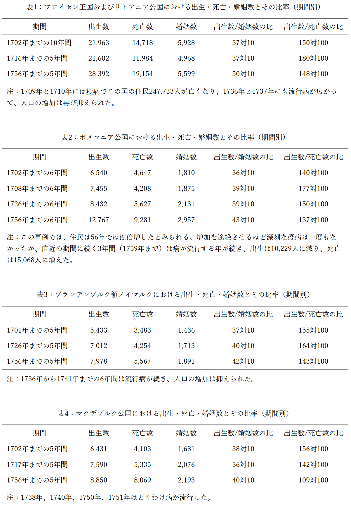

# 第七章

流行病の起こり得る原因——ズースミルヒ氏の統計表からの抜粋——一定の場合には病の多い季節が周期的に戻ると見込むべきこと——どの国でも短期間の出生数と死亡数の比率は、人口の実質的な平均増加を測る基準としては不十分——人口の持続的増加を示す最良の指標——生活の極度の倹約が中国とヒンドゥスタンの飢饉の一因——ピット氏の救貧法案の一条項に潜む有害な傾向——人口増加を促す正しい方法はただ一つ——国民の幸福の要因——飢饉は、自然が過剰人口を抑えるための最後にして最も恐ろしい手段——以上により、三つの命題は確立されたとみなす

衛生管理の徹底により、ロンドンではペストがついに根絶されたと考えられる。ただし、季節的な疾病の増加や流行の背景には、人口過密や不衛生で不十分な食糧事情が二次的要因として作用している可能性が高い。私がこの見解に至ったのは、イングランドとウェールズの人口論争に関する追補の脚注において、プライス博士が引用したズースミルヒ氏の統計表を検討した結果である。これらの資料は正確性が高いと評価されており、同様の統計表が広く普及すれば、各国において生活手段を上回る人口増加を抑制し、それを予防する仕組みが解明されるであろう。以下に、プライス博士の見解とともに、当該統計表の一部を示す（表一～表四）。

記録によれば、大疫病発生後の五年間は出生数が死亡数を最も大きく上回り、両者の比率が最大となった時期であった。

この場合、人口増加が健康維持に必要な食料と住居の拡充ペースを上回ったと考えるのが妥当だろう。そうであれば、庶民は生活を切り詰めざるを得ず、同居が進み、これらが疾病の目立った三年間を招いた一因となっていても不思議ではない。しかも、こうした事態は、国全体の人口が絶対的に過密でなくても起こりうる。人口がまばらな国でも、増産や住宅建設に先行して人口だけが増えれば、居住と生計の両面で困難や逼迫が生じる。例えば英国で、今後八年から十年のあいだに出生や結婚件数の増加が続き、住宅数が据え置かれれば、一戸当たりの人数は五、六人から七、八人へ増え、倹約を強いられる分だけ、庶民の健康に望ましくない影響が出る可能性が高い。

<figure class="table-image">
  
</figure>

詳細はズースミルヒ氏の統計表に譲り、同主題の補足も同表を参照されたい。ここに示した抜粋だけでも、疾病が多発する季節や流行期は完全に規則的とは言いがたいが、一定の周期性をもって再来していることが分かる。背景には住居の狭さや食料不足が大きく関与しており、それが流行を招いた主因の一つであった可能性が高い。

資料からは、これらの国々が不作や悪天候、疫病の流行期を挟みつつも、成熟国家としてはきわめて速い人口増加を示していたことがうかがえる。農業の改良が進み、それに伴って婚姻が促されたと考えられる。人口抑制の主因は、晩婚などの予防的な働きより、疾病や飢饉による死亡増といった要因であった。ある国で豊かさの拡大が見込まれて人口抑制の圧力が緩むと、その弛緩は当初の推進力が弱まった後も続きがちである。具体的には、生産拡大と労働需要の増加が労働者の暮らしを改善して婚姻を後押しすると、早婚は人口増が生産増を上回るまで続き、その結果、疾病が流行しやすい時期を招きやすくなる。したがって、食料が一時的に増えて人口増を刺激しても全需要に応えきれない国々は、人口が平均的な生産水準に柔軟に適応する国々より、周期的な疫病の流行にさらされやすい。

これまでの議論から逆の含意も導ける。周期的に疫病に見舞われる国では、他の条件が同じなら、流行の合間の人口増、すなわち出生超過は、疫病の影響が小さい国より大きくなる。もし過去一世紀のあいだ、トルコとエジプトの人口がほぼ横ばいで推移していたとすれば、流行が収まっていた時期には、フランスやイングランドより出生が死亡を上回る差はいっそう大きかったはずである。

ある国の人口動態を測るにあたり、五年ないし十年の平均的な出生数対死亡数の比だけでは、実態の推移を示す尺度として不十分である。この比は当該期間の増加ペースを示すにとどまり、その前後二十年にわたる動きは捉えられない。プライス博士はスウェーデン、ノルウェー、ロシア、ナポリ王国が急増していると指摘するものの、示された登録簿の抜粋は期間が短く、根拠としては弱い。それでもスウェーデン、ノルウェー、ロシアの人口が増加している可能性は高いが、伸びは短期の出生数対死亡数の比が示すほど速くはあるまい(プライス『復帰支払に関する考察』第二巻「イングランドとウェールズの人口をめぐる論争への追補」)。なお、一七七七年に終わる五年間のナポリ王国の出生対死亡比は百四十四対百で、同王国で百年規模で実際に確認される増加を上回りかねない勢いを示している。

ショート医師は、イングランド各地の村や市場町の教区簿を二期に分けて比較した。第一期はエリザベス女王の在位期から前世紀の中葉まで、第二期は前世紀末から今世紀の中葉までである。比較の結果、前期は出生が死亡に対し百二十四対百、後期は百十一対百にとどまった。前期の記録は信頼性に欠けるというプライス博士の指摘はあるものの、この比率はおおむね妥当とみてよい。少なくとも前期のほうが出生超過が大きくなりやすい理由はいくつも挙げられる。人口の自然な推移では、他の条件が同じなら、発展の初期ほど肥沃な土地が新たに開墾されやすいからである。ただし、各国の産出の伸びは、人々の勤労意欲とその方向づけに強く左右される。人々の知識や慣習、さらに一時的な要因、なかでも当時の市民的自由と平等の度合いが、その意欲を引き出し方向を定める。年々の産出が高い割合で伸びれば、人口もそれにおおむね比例して増えるのが通常である。さらに、前期に断続的に発生したペスト流行が出生超過の比率を押し上げた可能性もある。流行のなかった合間の十年間の平均だけを採るか、流行年を偶発的事象として除外すれば、教区簿の出生と死亡の比率は、実際の人口増加の平均より高めに出るだろう。一六六六年の大流行後の数年間は、出生が死亡を例年より大きく上回ったとみるのが自然である。とりわけ、その二十二年後の革命当時のイングランドは現在より人口が多かったとするプライス博士の主張が正しければ、この傾向はいっそう強まる。

キング氏は一六九三年、ロンドンを除く王国全体で出生数と死亡数の比を百十五対百と報告した。ショート医師は十八世紀半ば、ロンドンを含む場合の比を百十一対百と報告した。フランスでは、一七七四年に終わる五か年平均が百十七対百であった。これらの数値がおおむね正確で、時期による大きな変動がないとすれば、フランスとイングランドの人口は、各国の平均的な産出におおむね見合う水準に保たれていると考えられる。結婚の抑制とそれに伴って広がる望ましくない慣行、戦争、奢侈、大都市の緩慢ながら確実な人口減、そして貧困層の過密居住と乏しい食糧が、人口が生計手段や扶養能力を超えて膨張するのを抑えている。一見、奇異に響くかもしれないが、こうした抑制要因が、余剰人口を減らすために大規模で荒廃的な疫病を必要とする事態を、実質的に不要にしている。仮にイングランドで二百万、フランスで六百万の命を奪う大流行が起きても、その惨禍から回復した後には、両国の出生数と死亡数の比は現在より確実に高まるであろう。

ニュージャージーでは、一七四三年までの七年間の平均で、出生数は死亡数の三倍だった。フランスとイングランドでは、最大でも一・一七倍にとどまった。この差は驚くほど大きいが、神の奇跡とまで言うには及ばない。原因は不可解な神秘ではなく身近なところにあり、関心さえあれば誰にでも確かめられる。もっとも、解釈を極端に広げれば、石が落ちることや植物が伸びることを神の直接の働きとみなせないわけではない。しかし、経験は自然の働きがほぼ常に一定の法則に従っていることを示している。世界の始まり以来、人口の増減を左右する要因も、周知の自然法則と同程度に一貫してきた可能性が高い。

性的欲求は昔も今もおおむね変わらず、代数学になぞらえれば一定の定数とみなせる。人口は、その社会が国内生産や輸入で確保できる食料の量を超えては増えないという必然の法則に従う。これは誰の目にも明らかで、歴史の経験がそれを裏づけている。自然が過剰人口を抑える仕組みや手段は一定でも規則的でもないように見えるが、具体的な働きは見通せなくとも、結果が生じること自体は確実に予期できる。もし出生が数年にわたり死亡を大きく上回り、食料の増加率をはるかに上回る速度で人口が伸び続ければ、移住などの流出がないかぎり、やがて死亡が出生を上回る。したがって、その期間の増勢は、その国の人口の真の平均的増加を示してはいない。ほかに人口を減らす要因がなければ、どの国も周期的に疫病や飢饉に直面することになる。

人口が実質的かつ長期に増えたかどうかの確かな基準は、扶養手段、つまり生計維持手段や食料供給力の増加に尽きる。ただし、この基準にも小さな振れがあり、観察の範囲で確かめられる。いくつかの国では人口が人為的に押し上げられ、人々は次第に、ほとんど最低限の食で暮らすことに慣れていった。その結果、扶養手段が増えないのに人口だけが持続的に増えた時期があったとみられ、中国はその一例とされる。報告によれば、下層の人々はほぼ最低限の食で暮らし、欧州の労働者なら飢えていても口にしないような腐敗した内臓や屠殺の残渣でさえ、手に入れば感謝して受け取るという。親による子の遺棄を認める法も、主として人口を押し上げる方向に作用してきた。こうした国は必然的に飢饉に脆弱である。扶養手段に比べ人口が過密で、平均的な生産が住民の生命維持にかろうじて見合う水準にとどまるなら、天候不順によるわずかな不作でも致命的になりうる。さらに、ジェントゥーと呼ばれる人々のきわめて倹約的で質素な暮らしぶりも、幾分インド亜大陸の飢饉を招く一因と考えられる。

米国ではいま賃金水準がきわめて高く、凶作や欠乏の年であっても、低所得層は大幅な節約で家計の打撃を和らげ、深刻な困窮に陥りにくい。そのため、飢饉が起きる可能性はごく小さい。ただし、人口が増える過程では、いずれ労働者の報酬は今ほど潤沢でも手厚くもなくなり、その時点では、生計手段や食料など暮らしを支える資源の伸びはそれに比例しては増えない一方で、人口だけが持続的に増え続けると見込まれる。

欧州では生活様式の違いが、人口と食料消費の比率に一定の差をもたらす。南イングランドの労働者は上質な小麦パンに慣れており、生活水準をスコットランドの農民並みにまで落とすくらいなら、いっそ飢えるほうを選ぶ者もいる。しかし、厳しい必然の法則が働き続ければ、生活はやがて中国の低所得層に近い水準まで切り詰められ、同じ量の食料でより多くの人を養える余地が生まれるかもしれない。とはいえ、現実にそうなるよう仕向けるのは極めて難しく、人道的にも望ましくない。人口増を奨励する声は多いが、勢いがあるように見えて実際に増えないのは、扶養に必要な資金や資源の手当てをしないまま多人口を求めるからだ。耕地を広げて農業雇用を増やし、国内生産を伸ばし、労働者の暮らしを改善するなら、それに見合う人口増を恐れる理由はない。これを別の手段で成し遂げようとするのは不道徳で残酷な圧政で、自由な国では成り立たない。為政者や富裕層には、人口を無理に増やして賃金を押し下げ、海軍や陸軍の費用や輸出向け製造の原価を抑える策が得策に見えることもあるだろう。だが、とりわけ偽りの慈善を装って庶民に受け入れられやすい場合には、貧しい人びとの擁護者が厳重に監視し、断固として退けるべきだ。

私は、救貧法案に盛り込まれた「子どもが四人以上の場合、四人目以降一人につき労働者へ毎週一シリングを給付する」という条項について、ピット氏に不当な意図はなかったと考える。氏は提出前から成立直後までこの仕組みを有益と考えていた。しかし熟考の末、目的が貧困層の生活改善にあるのなら、かえってそれを損なう制度設計だと確信するに至った。国全体の生産は増えず、生産が伸びないまま人口だけが増えれば、同じ生産をより多くの人々で分け合うことになり、一日の労働で得られる食料は減る。結果として、貧困層全体の困窮は一層深まる。

生計手段がそれに比例して増えなくても、人口が長期にわたり増え続ける場合がある。ただし、各国の事情にかかわらず、食料の量で養える人口には越えられない上限があるのは明らかだ。したがって、人口が減少していない国では、労働者階級が暮らし、世代をつないでいくのに足る食料が安定的に確保され続けていなければならない。

条件が同じなら、国の人口は食用として供給される食料の量で決まり、国民の幸福はその配分の余裕、すなわち一日の労働で手に入る量に左右される。穀物栽培中心の国は牧畜中心の国より人口が多く、稲作中心の国は穀物栽培中心の国よりさらに多い。イングランドの土壌と気候は稲作に適さないが、ジャガイモはほぼ全土で栽培できる。アダム・スミス博士は、庶民の主食をジャガイモに改め、現在穀物に充てているのと同じ作付面積をジャガイモに回せば、この国はより多くの人口を養えるようになり、ほどなくその人口規模に達するだろうと述べた。

国の幸福は、貧富や国の若さ・老い、過疎か過密かといった属性で決まらない。肝心なのは成長の速度と、無制限に増え得る人口の年々の伸びに対して、食料生産の年々の増加がどれだけ追いついているかである。両者の歩調が最も合うのは新しい植民地で、成熟した社会の知識と勤勉さが肥沃で未利用の土地に生かされるからだ。他方、この観点では国が若いか老いているか自体は決定的ではない。現在の英国では、住民への食料供給は二千年前も三千年前も四千年前もおおむね同程度だとみられる。さらに、スコットランド高地の貧しく人口がまばらな地域も、豊かで人口密度の高いフランドル地方と同様に、過剰人口の圧力にさらされていると考える根拠がある。

たとえ一国が、より高度な技術や芸術をもつ外来民族に征服されることなく、文明を自力で発展させてきたとしても、生産が一から百万へと拡大する数百年のあいだに、食料不足に由来する直接・間接の困窮から人々が完全に解放される時期は一度として訪れなかったと考えられる。欧州諸国では、記録が始まって以来、この単純な理由により、絶対的な飢饉を経験していない国でさえ、数百万人規模で人口増が抑え込まれてきた。

私は、飢饉を自然が用いる最後にして最も厳しい手段と考える。人口の増加の勢いはやがて地球の食料生産力を上回り、その帰結として、どのような形であれ早死にが人類に避けがたく訪れる。人間の悪徳は人口減少をもたらす強力な要因となり、破壊の軍勢の先兵として働き、ときに単独でも惨事を招く。これでも抑えきれなければ、季節の不順や流行病、疫病やペストが大挙して押し寄せ、数千数万の命を奪う。なお、それでも足りなければ、巨大で避けられない飢饉が背後から現れ、一撃で世界の食料供給に見合う水準まで人口を引き下げる。

であれば、人類の歴史を丁寧に検証する者は、過去から現在に至るあらゆる時代と社会において、そう認めざるを得ないのではないか。

人口の増加は生活資源の供給量に必然的に制約され、食料などの生活資源が行き渡る範囲には限界がある以上、人口が増えうる速度や規模には資源量が定める上限がある、という考え方である。

生存手段や食料といった生活資源が拡大すれば、人口は必ず増えるという。では、その強い増加圧力は、貧困や困窮、悪習などによって抑え込まれ、実際の人口は生活資源に見合う水準に保たれるのか。
