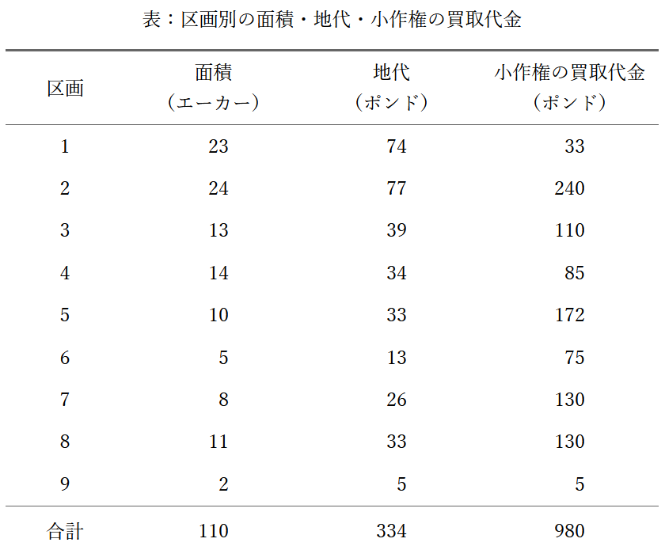

# 第十章　小作農を廃止する手段

## 一

本書の初版が執筆、刊行された当時、コティア人口をどう扱うかは、英国政府にとって最も急を要する実務上の問題だった。人口八〇〇万人の大半はコティア制度のもとで長年、停滞と深刻な貧困に沈み、制度の作用によって粗末で最も安価な食料に追いやられ、自分たちの境遇を改善するために何かをする力も、その気力も失っていた。ところが、その粗末な食料さえ凶作で得られなくなった結果、人々は餓死するか、他者に恒久的に扶養されるか、あるいはそれまで不運にも従わされてきた経済の仕組みを根本から改めるかという、逃げ場のない選択に追い込まれた。この非常事態は議会と世論の注意をこの問題に向けさせたが、ほとんど成果を生まなかった。害の原因は、飢えへの恐れを除けば勤労や倹約の動機をことごとく奪う土地賃借制度にあったのに、議会が用意した救済策は、救貧扶助を受ける法的請求権を与えて、唯一残っていたその動機さえ取り上げるものだったからである。他方で、害の原因を正すためには、むなしい非難以上のことは何も行われず、その先送りの代償として国庫は一、〇〇〇万ポンドの支出を余儀なくされた。

 
論じるまでもなく、アイルランドの経済的な苦境の根本原因は小作農制度にあり、この国で競争によって小作料が決まる慣行が続くかぎり、勤勉さも生産的な取り組みも、死以外の方法による人口抑制も、さらには貧困のほんのわずかな減少さえ期待できない。それは、あざみにいちじくを、いばらにぶどうを求めるようなものだ。現実主義の政治家がこの事実を認めない、あるいは理屈では認めていても、その現実を十分に実感できず、それに基づく政策を立てられないのなら、なお別の、純粋に物理的な条件がある。人びとがこれまで頼ってきた唯一の作物が不安定なままであり続けるなら、農業技術と勤労に新たな大きな刺激を与えなければならず、そうでなければアイルランドの土地は現状に近い人口をもはや養えなくなる。島の西半分の総生産は、地代に回す分を一切残さずにしても、住民全体を長期に支えるには足りない。したがって彼らは、移民か飢えによって産業力に見合う規模まで減るか、産業をはるかに生産的にする手段が見いだされないかぎり、帝国の租税の年々の負担として重くのしかかり続ける。
 

これらの言葉が書かれて以後、だれも予想しなかった事態が起こり、アイルランドを統治する英国の支配層は、本来なら無関心と見通しの甘さの代償として直面するはずだった苦境を免れた。小作農中心の農業体制のもとでアイルランドは自国民に十分な食料を供給できなくなっていたのに、英議会は人口の増加を促した一方で、生産を増やすための手立てをまったく講じなかった。ところが、政治の知恵が用意できなかった援助は思いがけないところからもたらされ、自助による移民であるウェイクフィールド方式が自発の原則にもとづき巨大な規模で進み、先に渡った人の稼ぎで後続者の費用をまかなう仕組みも広がった。その結果、当面は既存の農業体制が雇用を与え扶養できる水準まで人口が減り、一八五一年の国勢調査では一八四一年に比べ概数で一五〇万人減、続く一八六一年の調査でもさらに約五〇万人減となった。アイルランド人は、今後何世代にもわたって世界の人口増を余裕をもって支えられるほど繁栄した大陸へ渡る道を見いだし、農民たちも海の向こうを、サクソンの圧政と自然の厳しさの双方から逃れられる確かな避難先として意識するようになった。将来、英国式農業が全土に広がって農業労働の需要が大きく縮んだとしても、あるいはサザーランド県のように全土が牧場化したとしても、職を失った人々は、一八五一年以前の三年間に米国へ渡った一〇〇万人と同じ速さで、しかも国の負担なしに米国へ移住するとみられ、土地は数千人の地主のためにあり、地代さえ入ればよいと考える人々には、これがアイルランド問題の幸福な終幕に見えるのである。

しかし、いまやそのような傲慢な言い分が通る時代ではなく、人々の意識もそれを支えられる状態にはない。アイルランドの土地はもちろん、どの国の土地も、その国の人々に帰属するのであり、土地所有者と呼ばれる個人が道義と正義の上で主張しうるのは、地代、または土地の売却可能価値に見合う補償に限られる。土地そのものについて肝心なのは、権利をどのように配分し、どのように耕作すれば、住民全体にとって最も役に立つ形になるかという点である。地代を受け取る側からすれば、住民の大多数が、この国では正義を得られないと絶望し、国内では得られない土地の所有権を別の大陸に求めて去っていくことが都合よく見えるのかもしれないが、帝国の立法府は、数百万人にも及ぶ人々が強制的に国外へ追われる事態を、同じ目で見てはならず、別の目で見なければならない。政府が国を暮らしに適した場所にできず、その結果として住民が集団で国を去るのなら、その政府は裁かれ、非難される。地主の法的権利がもつ金銭的価値を一ファージングたりとも奪う必要はないが、正義のためには、実際に耕作する人々が、アイルランドでもアメリカと同じように、自分が耕す土地の所有者になれるようにしなければならない。

適切な政策を考えるうえで、この点は欠かせない。アイルランドの実情も海外の事例も知らず、社会や経済の良し悪しをイングランドの慣行だけで判断する人々は、アイルランドの困窮を解く唯一の方法として、小作農を賃金労働者に転換すべきだと主張するが、それは人々の暮らしを立て直すというより、アイルランド農業の仕組みを整える発想に近い。日雇いという立場には、先の見通しや倹約、自制心に乏しい人々に、それらを身につけさせる力がない。仮にアイルランドの農民を一律に賃金受給者へ変え、しかも従来の習慣や気質が残ったままであれば、四〇〇万人ないし五〇〇万人が、かつて小作農として送っていたのと同じ惨めな状態で日雇いとして暮らすだけだろう。あらゆる快適さの欠如に対しても同じように受け身で、同じように無計画に人口を増やし、働きぶりも、場合によっては同じように覇気を欠いたままになりかねない。というのも、彼らを一斉に解雇することはできず、仮にできたとしても、解雇はただ彼らを救貧税の扶養に戻すだけだからである。これに対して自作農にする場合、効果は大きく異なる。勤労と先見の点で学ぶべきことが多く、産業上の徳目ではヨーロッパでも後れた部類とされる人々を立ち直らせるには、そうした徳目を強く促す動機が必要だが、土地所有に匹敵する刺激はいまのところ見当たらない。耕す者が土地に恒久的な利害を持てば、尽きない勤勉さをほぼ保証できる。過剰人口の抑止は万全ではないにせよ、知られている限り最良の予防策であり、これが効かないなら他の計画はさらに大きく失敗しやすい。問題は、単なる経済上の処方では手が届かないところにある。

アイルランドの事情は、求められる条件という点でインドとよく似ている。インドでは、ときに大きな失策があったとしても、「農業改良」を名目に、ライヤット、つまり小作農を土地の占有から追い出すことが提案されたことはない。改良は、彼らの権利をより確かなものにすることで実現できるという考え方が基本で、意見の違いは、権利を恒久のものとすべきだとする側と、長期の賃貸借で足りるとみる側との対立にある。アイルランドにも同じ問いがある。実際、時に見られるような特定の地主のもとでは、長期賃貸借がアイルランドですら目覚ましい効果を上げた例があることは否定できない。だが、そのためには賃料が低いことが前提となる。長期賃貸借だけでコティア制を解消できると当てにすることはできない。というのも、コティア的な小作が続いてきた時代でも契約期間はもともと長く、二一年契約や三代併存が一般的だったのに、賃料が競争で決まり、支払えないほど高く設定されるため、借り手は土地から利益を得る権利を持てず、努力してもそれを獲得できなかったからである。その結果、契約が長いことの利点は、ほとんど名目にとどまった。インドでは、政府が不用意にゼミンダールへ所有権を譲り渡していないかぎり、政府自身が地主として自らの判断で賃料を定め、この弊害を防げる。だが、私的地主のもとでは賃料が競争で決まり、その競争の当事者が生きるためにあえぐ農民層である以上、人口が極端に少なく競争そのものが形だけにとどまる場合を除いて、長期賃貸借が結局は名目だけのものになることは避けにくい。多くの地主は目先の現金と目先の支配力をつかもうとするので、コティアが進んで何もかも差し出そうとするかぎり、地主が思慮ある自制によって悪習を和らげてくれると当てにするのは無駄である。

土地を永代に保有できる権利は、長期の賃借権よりも土地改良を促す力が強い。それは、最長の賃借権であっても、期限が近づくにつれてさまざまな短期賃借の段階を経て、最後には無権利へと至ってしまうからというだけでなく、より根本的な理由がある。純粋な経済学の議論であっても、想像力の影響をまったく考慮しないのは浅薄である。「永久」という見通しには、どれほど長い契約年限にもない効力がある。たとえ契約期間が、子どもを含む、個人が大切に思う人々の一生を覆うほど長くても、公共の利益（永続性を含む）を自分の感情や欲望より優先できるほど精神的に成熟していないかぎり、年々価値が減っていく権利しか持たない土地に、その価値を高めるための労力を同じ熱意で注ぐことはできない。さらに、ヨーロッパの諸国のように土地保有が永代であるのが一般原則である社会では、期限付きの保有権は、どれほど長期であっても格下のものと見なされがちで、取得しようとする熱意も、取得後の愛着も弱まりやすい。ただし、零細小作が広がる国では、永代かどうかは二次的であり、より重要なのは地代に上限を設けることである。利潤のために耕作する資本家が支払う地代は競争に委ねても差し支えないが、労働者が糧を得るために耕す場合の地代は、労働者が、労働者がいまだどこでも到達しておらず、またそのような小作条件のもとでは容易に到達できないほどの高度な文明と改良の段階にあるという例外を除いて、競争任せにはできない。小作という条件のもとでは労働者は弊害に対抗できる水準に達しにくいのだから、小農の地代は決して恣意的であってはならず、地主の裁量に委ねてはならない。慣習または法律によって地代を確定することが不可欠である。トスカナのメッタイエール制のように双方に有利な慣行が成立していない地域では、公的権限によって地代を定めて固定することが理性と経験にかなっており、そうすれば地代は定額地代となり、耕作者は小農の土地所有者へと近づいていく。

コティア小作制度を実質的に全面廃止できる規模で改めるには、議会が法律で一挙に実施するのが最も分かりやすく、具体的にはアイルランド全土の土地を小作人の所有としたうえで、帳簿上の名目の地代ではなく実際に支払われている地代を固定地代負担として課す案である。これは「保有権の固定」と呼ばれ、運動が最も成功した時期のリピール協会が掲げた要求の一つでもあったが、協会の初期から最も熱心かつ精力的にこれを唱えてきたコナー氏の言葉を借りれば、「評価と永続」と表したほうが趣旨ははっきりする。この措置は、地主が将来の地代上昇の見込みを放棄させられる以上、その見込みの現在価値を補償することを前提とする限り、不当とは言いにくい。既存の社会関係の断絶も、一九世紀初頭にシュタインとハルデンベルクの両大臣が勅令を重ねてプロイセン王国の土地制度を大きく改め、後世に国家の恩人として名を残した改革ほど激しくはならないだろう。啓蒙的な立場からアイルランド問題を論じたヴォン・ラウマーやギュスターヴ・ド・ボーモンにとっては、この種の処方が病状に対してあまりにも明白で適切に見え、なぜまだ実行されていないのか理解しにくかったという。

しかし、この案は、第一に、アイルランドの上層階級から財産をすべて取り上げることになり、これまで述べた原理に一定の妥当性があるとしても、そのような措置が正当化されるのは、重大な公共の利益を実現するための唯一の手段である場合に限られる。第二に、農業の担い手が小農の自作農だけになることは、それ自体が理想的だとは言いにくい。大きな資本で大規模に耕作し、国内で得られる最良の教育を受け、科学的発見の価値を理解できる教養を備え、費用のかかる実験に伴う遅延や危険も引き受けられる者が所有する大農場は、健全な農業制度を支える重要な一部である。実際、アイルランドにはそのような地主が少なからずおり、彼らをその地位から退けることは公共にとって不幸であり、社会全体の損失となる。さらに、現在の保有地の多くは、自作制度を最もよい条件で試すにはまだ小さすぎるおそれがあり、借地人が常に小農自作地の最初の取得者として適任だとも限らないため、借地人の中には、土地そのものをただちに与えるよりも、勤勉と倹約によって土地を得られるという希望を持たせたほうが、よりよい結果につながる者が少なくない。

ただし、同様の反発を招きにくい、もっと穏当な手段もあり、それを可能な限り徹底して実施すれば、求める目的は決して小さくない程度に実現できる。第一の策は、荒れ地を開墾した者をその土地の所有者と法的に認めることである。ただし条件として、荒れ地のままの価値に対する適度な利回りに相当する一定額の定額地代を負担させる。さらにこの制度には、開墾の必要が生じたとき、地主に対し、観賞用など装飾的性格をもつ土地を除く荒れ地の引き渡しを義務づけることが不可欠である。第二の策としては、個人が協力して、売りに出された土地をできる限り買い集め、それを小区画に分けて小農の自作地として売り直す方法がある。この目的の団体も以前に構想されたが、設立の試みは不成功に終わった。しかしその構想は、農業よりも選挙を主目的としてイングランドで成功してきた自由保有地団体の原則や考え方を、適用できる範囲で取り入れようとするものだった。

私的資本は、所有者が犠牲を払うことなく相当の利益を得ながら、アイルランドの社会経済と農業経済の立て直しに資金を投じるために活用できる。「荒れ地改良協会」が借り手にとってより不利な制度のもとで事業を進めながらも目覚ましい成果を上げた事実は、アイルランドの小農が、自分たちの取り組みが自らの利益になるという確かな見通しさえ与えられれば、大きな改善を成し遂げられることを示している。永久保有を原則にすることは必ずしも必要ではなく、協会が行ったように、適正な地代での長期賃貸で十分である。さらに、農民に対して、将来は蓄えた資本で農地を買い取れるという見通しを示せば、協会の借地人がその有益な制度のもとで短期間に資本を蓄えたのと同様の効果が期待できる。土地が売却されれば協会の資金は自由になり、別の地域で事業を再開できる。

## 二

ここまでの記述は一八五六年にまとめた。その後、アイルランド産業の大きな危機はさらに進行したので、本章前半で述べた見通しや実際の方策に関する見解が、現在の状況によってどのような影響を受けるかを検討する必要がある。

現在の最大の変化は、零細小作農による小作制度が大幅に縮小し、将来は全面的に消滅する可能性さえ見えてきた点にある。統計資料が示す小規模保有地の急減と中規模保有地の増加は、この全体的な事実を十分に裏づけており、各方面の証言からも、この傾向がいまも続いていることが確認できる。背景には、穀物法の廃止により、アイルランドの輸出が耕作物中心から牧畜産物中心へ移らざるをえなくなった事情があり、それだけでも、この保有形態の転換を引き起こすのに十分だった可能性が高い。放牧農場は資本家農民か地主でなければ運営が難しいことが、形態転換を後押ししたと考えられる。さらに、人口の大規模な移動を伴うこの変化は、大量の移民に加え、政府がアイルランドにもたらした最大の恩恵とも評される「負債付地所法」によって、著しく促進され、より迅速になった。同法の主要な規定は、土地財産裁判所を通じて社会制度の中に恒久的に組み込まれ、現在ではアイルランドの土地の大半が地主の直営か、小規模な資本家農民の経営に移ったとみられる。こうした農民の暮らし向きが改善し、資本を蓄えていることを示す材料も多く、主要な取引先である銀行で預金が大幅に増えていることが、その一例である。ただし、この階層にいまなお欠けているのは、小作権の安定、あるいは改良投資に対する補償が確実に得られるという保障である。これらを満たす手段は有識者の検討課題となっており、一八六四年秋のロングフィールド判事の演説と、それが呼んだ反響は一つの画期となった。いまや、数年以内に実効性のある措置が講じられると、かなりの確信をもって期待できる段階に達している。

追放された小作農のうち、移住しなかった者はいまどのように暮らしているのか。また、土地を持たず農業労働だけで生計を立てる人びとの現状はどうか。今のところ、彼らの状態は深刻な貧困の中にあり、改善の見通しは乏しい。貨幣賃金は一世代前の悲惨な水準から大きく上がったものの、生活費も旧来のじゃがいも中心の水準をはるかに超えて上昇しており、実質的な改善は名目ほどではない。私が得られるかぎり確かな情報によれば、この階層に生活水準の向上が広がった形跡はほとんどない。人口は減ったとはいえ、アイルランドの人口はなお、イングランドの一牧畜地帯のように単なる放牧地として支えられる規模を大きく上回る。国内で現在の住民数を維持するには小作制度に戻るか、自給的な小規模の自作農になるしかないという見方は、厳密には必ずしも真ではない。耕作が続いている土地では、投資の安全が十分に確保されるなら、小資本の農場経営者が労働者をより幅広く雇い入れ、現存する人口を支えうるという見方も、識者の一部にあるからだ。とはいえ、その手段だけで国の大多数の農民が生きるに足る状態を保てると言い張る人はいない。こうした中で、いったん減っていた移住は不作という刺激を受けて再び勢いを増し、一八六四年の一年だけで少なくとも一〇万人以上がアイルランドを後にしたと推計される。移住者本人とその子孫、さらに人類全体の利益という観点からは、この結果を嘆くのは愚かだろう。移住者であるアイルランド人の子どもはアメリカ人として教育を受け、出自の国では望めなかった速さと徹底さで、より高い文明の恩恵を受ける側に入り、二〇年ないし三〇年もすれば精神面ではほかのアメリカ人と区別できないほどになる。損失と不名誉を負うのはイングランドであり、アイルランドの土地だけを保持して住民を失うことが名誉と利益にかなうのか、主として問われるのはイングランドの国民と政府である。アイルランド人の現在の感情と、生活改善への期待が恒常的に向かいつつある方向を踏まえると、イングランドの選択肢は、おそらく、人口流出を放置するか、労働人口の一部を自作農へ転換するかの二つにほぼ限られる。多くの文明国で優勢な農業経済のあり方に対する公人の島国的な無知が、より悪い選択を招くおそれをいっそう強めているが、それでもアイルランドには自作農の形成へ向かう芽があり、友好的な立法者の後押しがあれば育ちうる。次に示すのは、私の高名で敬愛する友人であるケアンズ教授からの私信の一節である。

約八年ないし一〇年前、抵当不動産裁判所でトモンド、ポータリントン、キングストンの各地所が売却に付された際、居住して耕作を続けていた占有小作人のうち相当数が、自分の農地の完全所有権を買い取ったことが確認されている。だが、その後、買い取った者たちが小規模な自作地をそのまま耕し続けたのか、それとも地主志向の熱に浮かされて従来の暮らしから抜け出そうとしたのかについては、確かな情報がない。もっとも、この点を考えるうえで見落とせないのは、小作権が広く認められている地域では農場の営業権に支払われる価格がきわめて高くなるという事実である。現在、地主地所裁判所で手続き中のニューリー近郊のある地所について、明細表から抜き出した次の数字は一例にすぎないが、この単なる慣習上の権利が一般にどの程度の価格で取引されるかについて、おおよその見当を与えるだろう。

ニューリー近郊の幾つかの農場について、小作権がいくらで売却されたかを示す一覧表は、以下のとおりである。

<figure class="table-image">
  
</figure>

ここで示した価格は全体として地代の約三年分に当たるが、前にも述べたとおり、実際に、しかも頻繁に、さらには通常支払われている額を十分に反映していないことが多く、実勢はもっと高いとみられる。小作権は慣習に基づく権利にすぎないため、その価値は地主の誠実さに対する社会的な信頼の強さによって上下する。今回の事例では、土地売却に関する手続きの過程で明らかになった事情から、当該地主への信頼は高くなかったとみられ、したがって上記の水準は一般の相場よりかなり低いと考えられる。確かな情報によれば、国内の別の地域でも、土地財産裁判所において小作権の代金が土地の完全所有権と同額だった例があった。なお、地代の負担が残る土地に対して二〇年分や二五年分を支払う例があるのは注目される。同額か、わずかな上乗せで土地を完全に買い取れるのに、なぜそうしないのかという疑問への答えは、現行の土地法制にある。土地を小口で移転するための手続費用は代金に比べて非常に重く、土地財産裁判所でさえ例外ではない。その一方で、農場の営業権は費用なしで移転できるためである。同裁判所では節約が厳格に求められているが、それでも最も安い譲渡証書の作成費用は印紙税を除いて一〇ポンドかかり、小規模な農民の購入にとっては無視できない負担となる。一、〇〇〇エーカーの移転であっても費用は同程度か、増えてもわずかだろう。もっとも、障害は証書費用だけではなく、より深刻なのは土地の権利関係が複雑で、小口の買い手が手の届く規模に分割することがしばしば不可能になる点である。しかし、この状況の改善には、近い将来のどの下院も粘り強く審議する可能性が高くないほど抜本的な措置が必要だろう。権利の登記は複雑な所有関係を整理して示す助けにはなるが、実体の複雑さが残る以上、形式を簡素化するだけでは解消しない。地主の処分権が縮小されないまま、各入植者や遺言で財産を残す人が見栄や支配欲、気まぐれで権利関係をほとんど際限なく増やせる状態が続くなら、登記制度だけでは根本的な解決にならない。こうした事情は大口取引に大きな利得を与え、その他の取引を事実上締め出している。この法状況の下では農民自作制度の試みを公正に検証できないのは明らかだが、同時に、導入に対する国民の受け入れ意欲が障害ではないことも、ここまでの事実が示している。

本書の分量に比して不釣合いに長くなった議論を、ここでいったん結ぶ。あわせて、土地の生産物が一つの階級に分けずに帰属する場合や、二つの階級のあいだでだけ分配される場合といった、より単純な社会経済の形態についての検討も、ここで区切りをつける。次は、土地の生産物が労働者、地主、資本家の三者に分けて配分されるという仮定に進む。そして、これからの議論をこれまでの論点にできるだけ密接につなぐために、まず賃金を取り上げる。
